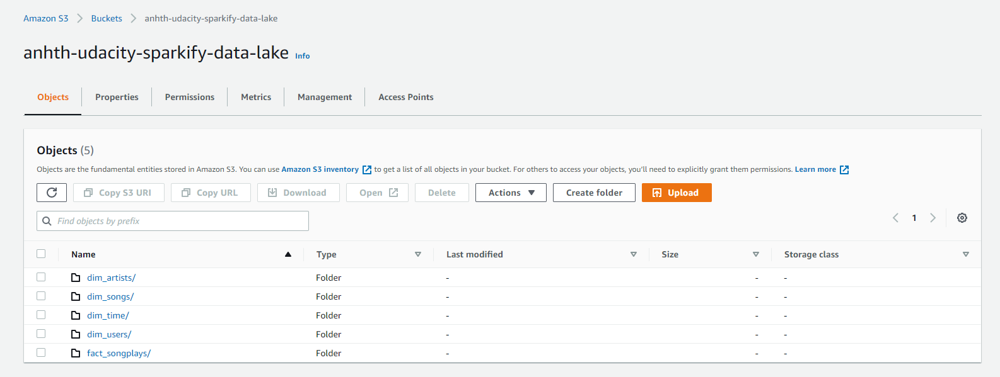

# Project: Data Lake

## Summary
* [Project Overview](#Project-Overview)
* [Star Schema](#Star-Schema)
* [Project structure](#Project-Structure)
* [How to run](#How-to-run)

## Project Overview
Continue the story about Sparkify company. In this project, we'll use Spark and data lakes to build an ETL pipeline for a data lake hosted on AWS S3.

## Star Schema
### Fact Table
1. songplays - records in event data associated with song plays i.e. records with page NextSong<br>songplay_id, start_time, user_id, level, song_id, artist_id, session_id, location, user_agent
### Dimension Tables
2. users - users in the app<br>user_id, first_name, last_name, gender, level
3. songs - songs in music database<br>song_id, title, artist_id, year, duration
4. artists - artists in music database<br>artist_id, name, location, lattitude, longitude
5. time - timestamps of records in songplays broken down into specific units<br>start_time, hour, day, week, month, year, weekday

Here is the schema:


## Project Structure

1. /img : image folder for README.md
2. `etl.py`: ETL pipeline structure for a data lake
3. `dhw.cfg` : config file with information of AWS

## How to run

First you need to edit file `dwh.cfg` and with following structure:

```
[AWS]
AWS_ACCESS_KEY_ID=</Import AWS Access Key ID>
AWS_SECRET_ACCESS_KEY=</Import AWS Secret Access Key>
```

Next, go to etl.py file and insert your S3 bucket path into variable `output_data` in `main` function

```
def main():
    """
    Main function
    """
    spark = create_spark_session()
    input_data = "s3a://udacity-dend/"
    output_data = "s3a:// </Insert your S3 bucket path> /"
    
    process_song_data(spark, input_data, output_data)    
    process_log_data(spark, input_data, output_data)
```


Final, run ETL pipeline in cmd below:

```
python etl.py
```

Result, go to S3 bucket and check the output data




