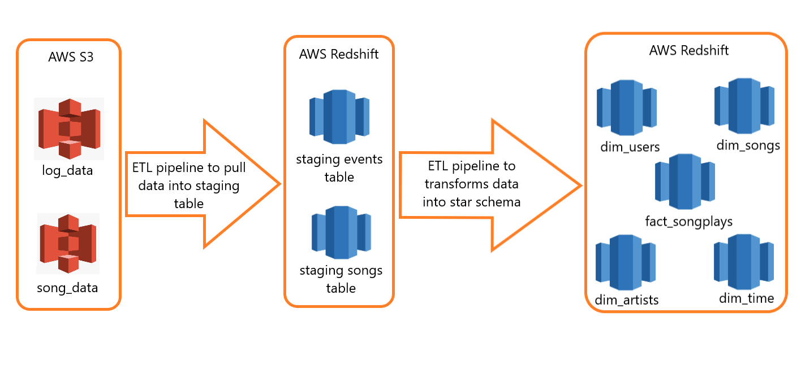
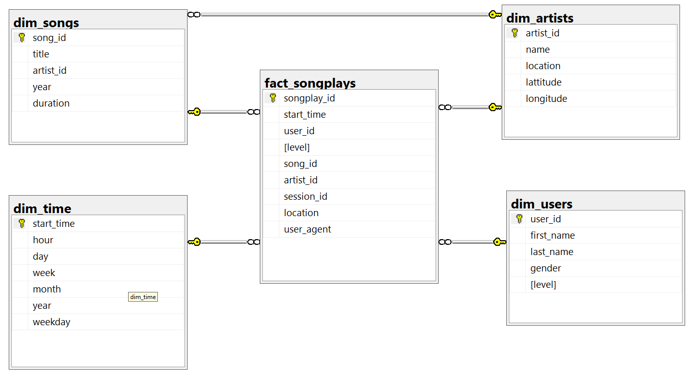

# Project: Data Warehouse

## Summary
* [Introduction](#Introduction)
* [Project Overview](#Project-Overview)
* [Star Schema](#Star-Schema)
* [Project structure](#Project-structure)
* [How to run](#How-to-run)

## Introduction
A music streaming startup, Sparkify, has grown their user base and song database and want to move their processes and data onto the cloud. Their data resides in AWWS S3, in a directory of JSON logs on user activity on the app, as well as a directory with JSON metadata on the songs in their app.

As their data engineer, we are tasked with building an ETL pipeline that extracts their data from S3, stages them in Redshift, and transforms data into a set of dimensional tables for their analytics team to continue finding insights in what songs their users are listening to. We'll be able to test our database and ETL pipeline by running queries given to our by the analytics team from Sparkify and compare our results with their expected results.

## Project Overview
In this project, we'll apply what you've learned on data warehouses and AWS to build an ETL pipeline for a database hosted on Redshift. To complete the project, we will need to load data from S3 to staging tables on Redshift and execute SQL statements that create the analytics tables from these staging tables.

Here is our project main flow:



## Star Schema
### Fact Table
1. songplays - records in event data associated with song plays i.e. records with page NextSong<br>songplay_id, start_time, user_id, level, song_id, artist_id, session_id, location, user_agent
### Dimension Tables
2. users - users in the app<br>user_id, first_name, last_name, gender, level
3. songs - songs in music database<br>song_id, title, artist_id, year, duration
4. artists - artists in music database<br>artist_id, name, location, lattitude, longitude
5. time - timestamps of records in songplays broken down into specific units<br>start_time, hour, day, week, month, year, weekday

Here is the schema:



## Project structure

1. /img : image folder for README.md
2. `create_tables.py` : drop old table if exist and create new star schema
3. `etl.py` : defines ETL pipeline
4. `sql_queries.py` : The SQL CREATE, DROP, COPY and INSERT query
5. `dhw.cfg` : config file with information of AWS

## How to run

First you need to edit file `dwh.cfg` and with following structure:

```
[CLUSTER]
HOST=</Enter cluster endpoint>
DB_NAME=</Enter database name>
DB_USER=</Enter database user>
DB_PASSWORD=</Enter database password>
DB_PORT=</Enter database port, defaul is 5439>
CLUSTER_IDENTIFIER=</Enter cluster name>

[IAM_ROLE]
ARN=</Enter ARN link Redshift role>

[S3]
LOG_DATA='s3://udacity-dend/log_data'
LOG_JSONPATH='s3://udacity-dend/log_json_path.json'
SONG_DATA='s3://udacity-dend/song_data'
REGION=us-west-2

[AWS]
ACCESS_KEY=</Enter access key>
SECRET_KEY=</Enter secret key>
SESSION_TOKEN=</Enter session token>
```

Next, we will execute create table task and run the ETL by following:

```
python create_tables.py
python etl.py
```


